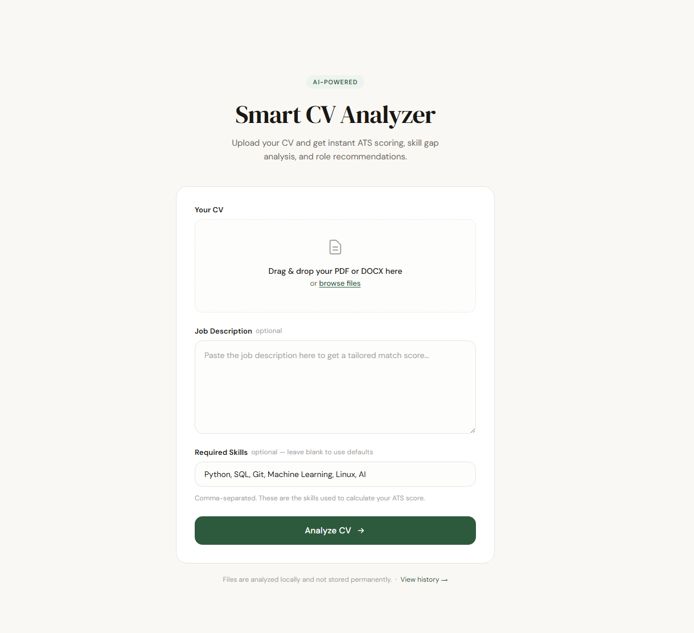
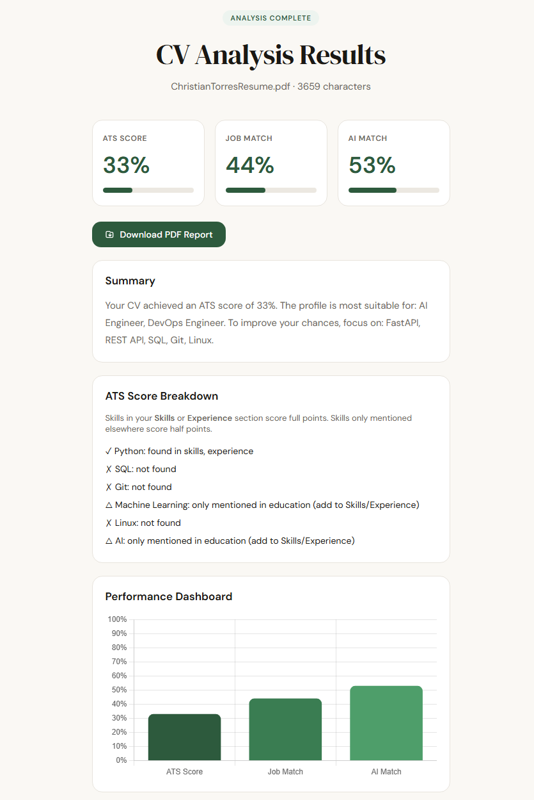
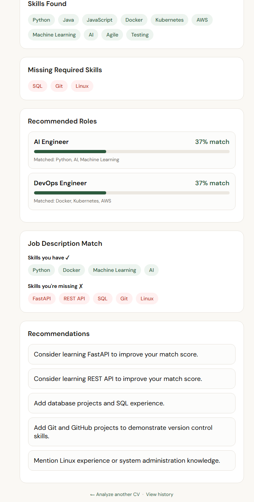
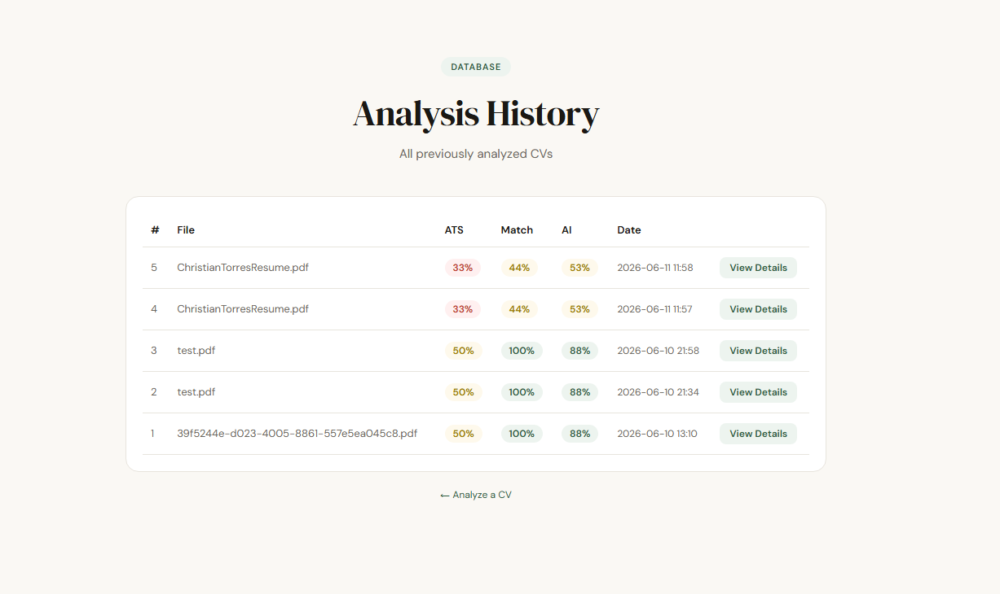
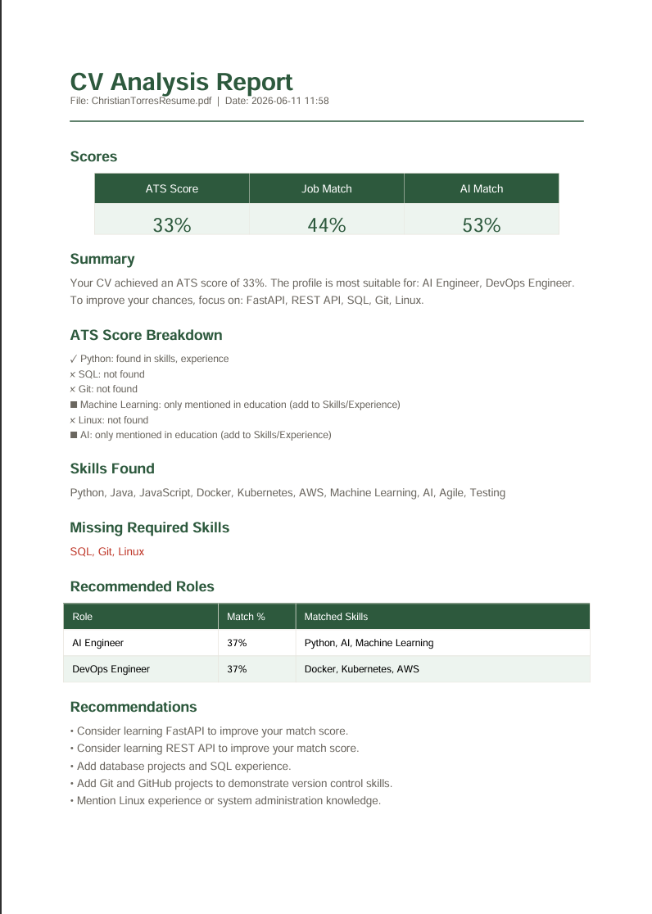

# Smart CV Analyzer

An AI-powered CV analysis tool built with FastAPI. Upload your CV and get instant ATS scoring, skill gap analysis, career role recommendations, and a personalized summary written by Claude AI.


---

## Features

- **ATS Scoring** — section-aware scoring that gives full points for skills in your Skills/Experience section and half points for skills only mentioned in Education
- **80+ Skills Detected** — with alias matching (e.g. `JS` → JavaScript, `k8s` → Kubernetes, `postgres` → SQL)
- **AI Semantic Similarity** — uses `sentence-transformers` to measure how well your CV matches a job description beyond just keywords
- **Claude AI Summary** — personalized analysis written by Claude (Anthropic API)
- **Career Role Matching** — matches your skills against 8 career paths (AI Engineer, Data Scientist, DevOps Engineer, Full Stack Developer, and more) with a percentage score
- **Custom Required Skills** — define your own required skills per upload instead of using the defaults
- **Job Description Matching** — paste a job description to see exactly which skills you have and which you're missing
- **PDF & DOCX Support** — accepts both file formats
- **Analysis History** — every analysis is saved to a database with a View Details button
- **Downloadable PDF Report** — export any analysis as a formatted PDF report
- **Mobile Responsive** — works on all screen sizes

---

## Screenshots

### Upload Form


### Analysis Results




### History


### PDF Report


---

## Tech Stack

| Layer | Technology |
|---|---|
| Backend | FastAPI, Python 3.10+ |
| AI / NLP | Anthropic Claude API, sentence-transformers, scikit-learn |
| Database | SQLite + SQLAlchemy |
| PDF Generation | ReportLab |
| File Parsing | pypdf, python-docx |
| Frontend | Jinja2 templates, vanilla JS, Chart.js |

---

## Project Structure

```
Smart-CV-Analyzer/
├── app.py              # Main FastAPI application
├── database.py         # SQLAlchemy models and DB setup
├── migrate.py          # One-time DB migration script
├── templates/
│   ├── index.html      # Upload form
│   ├── result.html     # Analysis results page
│   └── history.html    # Analysis history page
├── static/
│   └── style.css       # Styles
├── uploads/            # Temporary file storage (auto-created)
├── cv_analysis.db      # SQLite database (auto-created)
├── .env                # API keys (not committed to git)
└── requirements.txt    # Python dependencies
```

---

## Getting Started

### 1. Clone the repository

```bash
git clone https://github.com/your-username/smart-cv-analyzer.git
cd smart-cv-analyzer
```

### 2. Install dependencies

```bash
pip install -r requirements.txt
```

### 3. Set up your Anthropic API key

Create a `.env` file in the project root:

```
ANTHROPIC_API_KEY=your-api-key-here
```

Get a free API key at [console.anthropic.com](https://console.anthropic.com). New accounts receive $5 in free credits.

> The app works without an API key — it falls back to a standard summary automatically.

### 4. Run the database migration

Only needed if you have an existing `cv_analysis.db` from a previous version:

```bash
python migrate.py
```

### 5. Start the server

```bash
python -m uvicorn app:app --reload
```

Open [http://localhost:8000](http://localhost:8000) in your browser.

---

## Requirements

Create a `requirements.txt` file with:

```
fastapi
uvicorn
pypdf
python-docx
sentence-transformers
scikit-learn
sqlalchemy
reportlab
anthropic
python-dotenv
python-multipart
jinja2
```

---

## How It Works

### ATS Score
Checks your CV against a set of required skills (customizable). Skills found in your **Skills** or **Experience** section score full points. Skills only mentioned in Education score half points, since they indicate familiarity rather than practical experience.

### Job Match Score
Extracts skills from the pasted job description and calculates what percentage of those skills appear in your CV.

### AI Semantic Match
Uses `all-MiniLM-L6-v2` from sentence-transformers to encode both your CV and the job description as vectors, then calculates cosine similarity. This catches conceptual matches that keyword scanning misses.

### Claude AI Summary
Sends the full analysis data to Claude and asks for a personalized 3–4 sentence summary with specific, actionable advice.

---

## Environment Variables

| Variable | Required | Description |
|---|---|---|
| `ANTHROPIC_API_KEY` | Optional | Enables AI-generated summaries. Falls back to template summary if not set. |

---

## .gitignore

Make sure your `.gitignore` includes:

```
.env
cv_analysis.db
uploads/
__pycache__/
*.pyc
*.pyo
.venv/
venv/
```

---

## License

MIT License — feel free to use, modify, and distribute.

---

## Author

Built by [Abdulaziz Ismail Abdulrab]
